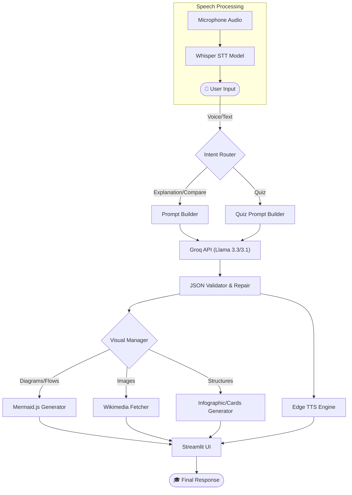

<div align="center">
  
  
  

</div>

<br />
<div align="center">
  <h1 align="center">VidyaSaarthi 🎓</h1>
  <p align="center">
    <strong>Where Knowledge Meets Innovation</strong>
    <br />
    <em>Transforming education through conversational AI, structured learning, and smart visualizations.</em>
  </p>
</div>

---

## 📖 Overview & Impact

VidyaSaarthi is an advanced, voice-enabled AI teaching assistant that revolutionizes digital learning for school students (Classes 5 to 10). By simply speaking or typing a topic, students receive structured, NCERT-aligned explanations alongside beautiful visual aids and interactive quizzes. 

Serving as an infinitely patient, 24/7 tutor, VidyaSaarthi supports multiple languages (English, Hindi, and Hinglish). It acts as a powerful study aid for students and a dynamic, on-the-fly presentation tool for teachers in smart classrooms.

---

## ✨ Key Features & Visual Learning

*   **🎙️ Voice-First Interaction:** High-accuracy Speech-to-Text via Groq Whisper and natural, multi-lingual audio feedback via Edge TTS.
*   **🧠 Adaptive AI Teaching:** Dynamic prompt routing ensures explanations and quiz difficulty (MCQ/True-False) scale perfectly to the student's class level.
*   **📊 Multi-Layered Visualizations:** Automatically selects the best visual aid for any topic:
    *   **Mermaid.js:** Generates flowcharts and mindmaps for processes.
    *   **Wikimedia API:** Fetches labeled diagrams and anatomical SVGs.
    *   **HTML/CSS Cards:** Renders beautifully styled infographic steps, timelines, and comparison cards.

---

## 🏗️ Architecture & Pipeline

User requests are seamlessly routed, processed, and rendered in real-time. The pipeline moves from **Intent Routing** → **LLM JSON Generation** → **Visual & Audio Orchestration** → **Streamlit Rendering**.



---

## 📂 Project Structure

```text
nscif/
├── app.py                      # Main entry point, configures Streamlit routing
├── llm.py                      # LLM engine: Intent classification, Groq API, JSON validation
├── prompt_builder.py           # Dynamically builds complex, multi-language system prompts
├── requirements.txt            # Python dependencies
├── .env                        # Environment variables (API Keys)
├── pages/                      # Streamlit UI Views
│   ├── pg_home.py              # Home screen with voice/text triggers
│   ├── pg_notes.py             # Renders structured notes and visuals
│   ├── pg_quiz.py              # Interactive quiz interface
│   ├── pg_type.py              # Text input mode
│   └── shared.py               # Shared session state, CSS loader, processing pipeline
├── speech/                     # Audio Processing
│   ├── stt.py                  # Whisper-based Speech-to-Text
│   └── tts.py                  # Edge-TTS based Text-to-Speech
└── visuals/                    # Visualization Engine
    ├── visual_manager.py       # Orchestrates visual asset generation
    ├── infographic_generator.py# Generates HTML/CSS processes, tables, and cards
    ├── mermaid_generator.py    # Renders Mermaid.js charts
    ├── wikimedia_fetcher.py    # Hybrid Wikimedia Commons image search
    └── style.css               # Global application styling
```

---

## 🛠️ Technology Stack

| Component | Technology |
| :--- | :--- |
| **Language** | Python 3.10+ |
| **Frontend UI** | Streamlit, HTML/CSS |
| **Core LLM** | Groq API (Llama 3.3-70b-versatile, Llama 3.1-8b-instant) |
| **Speech-to-Text** | Groq Whisper (whisper-large-v3-turbo) |
| **Text-to-Speech** | Edge-TTS (`en-IN-NeerjaNeural`, `hi-IN-SwaraNeural`) |
| **Visualizations** | Mermaid.js, Wikimedia API |
| **Audio Processing** | Pydub, Streamlit-Audiorecorder |

---

## 🧠 Prompt Design Strategy

To ensure high-quality educational content while minimizing token usage, VidyaSaarthi uses a modular, dynamic **Prompt Builder** rather than static prompts.
* **Persona Injection:** Forces the LLM to act as a warm, encouraging Indian school teacher rather than a robotic AI.
* **Curriculum Alignment:** Dynamically injects NCERT guidelines and scales the explanation depth based on the student's selected class level (Class 5 vs Class 10).
* **Strict JSON Schemas:** Enforces a rigid JSON output format, allowing the backend to safely parse out text, TTS scripts, and Mermaid.js syntax in a single API call without breaking the UI.
* **Bloom's Taxonomy:** Quiz generation prompts strictly follow educational frameworks (Remember, Understand, Apply, Analyze).

---

## 🌍 Localization & Accessibility

A core mission of VidyaSaarthi is making education accessible to non-native English speakers.
* **Multilingual Input & Output:** Fully supports **English, Hindi, and Hinglish**. The LLM is strictly prompted to return technical terms in English while keeping conversational explanations in the user's native tongue.
* **Native Speech Synthesis:** Utilizes region-specific Edge-TTS voices (`en-IN-NeerjaNeural` and `hi-IN-SwaraNeural`) to ensure the AI sounds like a natural, local teacher rather than a foreign text-to-speech engine.

---

## 🚀 Working Pipeline

1. **User Input:** The user asks a question via microphone or text input. If audio is provided, it is transcribed using the Groq Whisper model.
2. **Intent Classification:** Python heuristic matching (with a fallback lightweight LLM) determines if the user wants an explanation, quiz, comparison, homework help, etc.
3. **Prompt Generation:** The `prompt_builder` constructs a system prompt enforcing the teacher persona, NCERT rules, output JSON schema, visual requirements, and language constraints.
4. **LLM Execution:** The query is sent to the Groq API. A retry wrapper with model fallback ensures reliability.
5. **JSON Validation:** The LLM's response is aggressively parsed, repaired (if needed), and validated against strict schemas (`_EXPLANATION_REQUIRED` or `_QUIZ_REQUIRED`).
6. **Visual & Audio Generation:** 
    * The `visual_manager` parses the requested `visual_type` and routes it to the corresponding generator (Mermaid, HTML Infographics, or Wikimedia).
    * `edge-tts` asynchronously generates the spoken audio script.
7. **Rendering:** Streamlit routes to the appropriate page (`pg_notes.py` or `pg_quiz.py`) and renders the rich, interactive UI.

---

## 🖼️ Visual Learning System

VidyaSaarthi utilizes a multi-layered approach to provide the best possible visual aid for any given topic:

*   **Wikimedia Images:** Fetches highly relevant labeled diagrams and SVGs for anatomical or geographical topics (e.g., Human Heart, Solar System).
*   **Mermaid.js Diagrams:** Dynamically creates flowcharts, mindmaps, and classification trees for processes and hierarchical concepts.
*   **HTML Infographics:** Renders beautiful, step-by-step numbered infographic cards for sequential processes.
*   **Comparison Cards:** Creates side-by-side interactive cards to highlight differences between concepts (e.g., Plant Cell vs. Animal Cell).
*   **Timeline Cards:** Visualizes historical events or sequential discoveries in a vertical timeline format.
*   **Tables:** Generates structured numerical or categorical comparisons.

---

## ⚙️ Installation & Local Setup

### Prerequisites
*   Python 3.10 or higher
*   A free [Groq API Key](https://console.groq.com/)

### 1. Clone the repository
```bash
git clone https://github.com/yourusername/vidyasaarthi.git
cd vidyasaarthi
```

### 2. Create and activate a Virtual Environment
```bash
# Windows
python -m venv venv
venv\Scripts\activate

# macOS/Linux
python3 -m venv venv
source venv/bin/activate
```

### 3. Install Dependencies
```bash
pip install -r requirements.txt
```

### 4. Setup Environment Variables
Create a `.env` file in the root directory and add your API key:
```env
GROQ_API_KEYS=your_groq_api_key_here
```
*(You can provide a comma-separated list of keys for automatic rate-limit rotation).*

### 5. Run the Application
```bash
streamlit run app.py
```
The app will open automatically in your browser at `http://localhost:8501`.

---

## ⚠️ Current Limitations

While VidyaSaarthi is highly capable, the current implementation has a few known limitations:
*   **API Rate Limits:** Heavy reliance on the free Groq API tier can occasionally result in rate-limit errors (though API key rotation and model fallbacks are implemented to mitigate this).
*   **TTS Dependency:** Edge-TTS requires an active internet connection and relies on Microsoft's Edge text-to-speech service, which may experience latency.
*   **Browser Audio Support:** The Streamlit audio recorder may have varying compatibility across different web browsers (Chrome/Edge recommended).
*   **Language Scope:** Currently, the system is strictly optimized for English, Hindi, and Hinglish.

---

## 🔮 Future Roadmap

Based on the current architecture, here are the planned, realistic improvements for VidyaSaarthi:

*   **Expanded Quiz Modes:** Introduce "Fill in the Blanks" and short-answer questions to diversify the testing formats.
*   **Study Notes Export:** Allow students to download their AI-generated notes and visualizations as neat PDF or Markdown files for offline studying.
*   **Session History & Profiles:** Implement user accounts or local storage saving to let students revisit past topics and quiz results seamlessly.
*   **RAG Integration for Syllabus:** Integrate basic Retrieval-Augmented Generation (RAG) so the AI can strictly reference uploaded chapters or specific NCERT PDFs.
*   **Enhanced Multi-Lingual TTS:** Incorporate more regional Indian languages and dialects into the Voice Assistant pipeline.

---


## 🤝 Contributing

Contributions are welcome! If you'd like to improve VidyaSaarthi:
1. Fork the repository.
2. Create a new branch (`git checkout -b feature/AmazingFeature`).
3. Commit your changes (`git commit -m 'Add some AmazingFeature'`).
4. Push to the branch (`git push origin feature/AmazingFeature`).
5. Open a Pull Request.

---

## 📜 License

Distributed under the **MIT License**.

**Acknowledgements:** Built with [Streamlit](https://streamlit.io/), [Groq](https://groq.com/), [Mermaid.js](https://mermaid.js.org/), and [Edge-TTS](https://github.com/rany2/edge-tts).

# First Learn Git